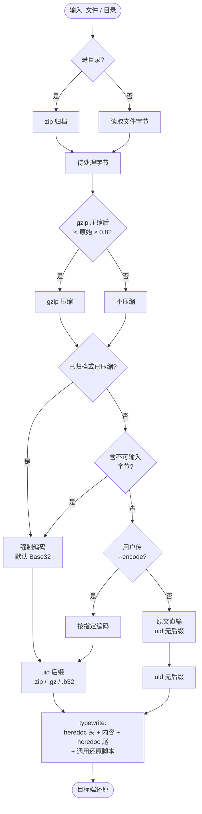
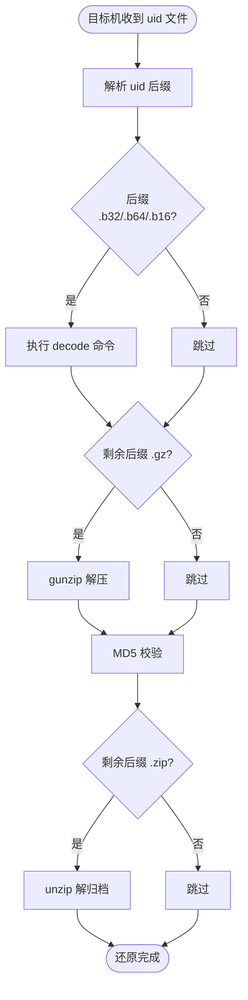
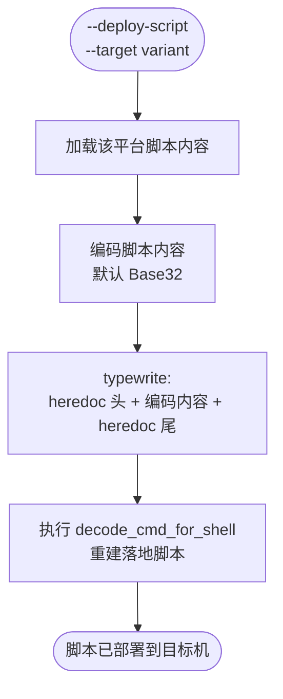
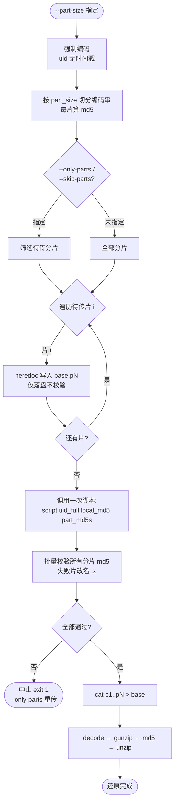

# typepaste-rs

`typepaste` 的 Rust 重写版。通过模拟键盘输入把文件/目录「粘贴」到目标机（如云桌面、远程桌面等无法直接粘贴的场景）。**非 1:1 移植**——重新设计了数据管线与还原流程，单引擎跨平台。

## 功能特性

- **统一数据管线**：归档（目录强制 zip）→ 压缩（gzip，仅当压缩后 < 原始 × 0.8 才用）→ 编码（归档/压缩强制，否则按 `--encode`）→ typewrite → 目标端还原。
- **uid 承载管线状态**：文件名 `typepaste_{ts}_{name}[.zip][.gz][.{suffix}]`，后缀依次表示归档→压缩→编码；目标端脚本据后缀**反向**还原（decode → gunzip → unzip）。
- **统一还原流程**：编码内容 heredoc 写入 + 调用已部署的跨平台还原脚本自动还原 + MD5 校验；`--restore-script <name>` 可指定目标机已部署的自定义脚本；纯 ASCII 文本默认原文直输（不含强制编码场景时）。
- **shell 适配 heredoc**：`--shell` 决定写入语法——bash 用 `cat > f << 'EOF'` / `EOF`；powershell 用 `$content = @'` / `'@` + `Set-Content -NoNewline`。deploy 模式的 decode 命令也按 shell 适配（powershell 用 python3）。
- **跨平台还原脚本交付**（`--deploy-script` 独立动作）：内嵌 linux / mac / gitbash / powershell 四变体，可预览或 typewrite 部署到目标机；交付自身可编码（默认 base32）以规避特殊字符/IME 问题。
- **enigo 单引擎**：跨平台（macOS / Linux / Windows）键盘鼠标模拟，`Key::Unicode` + 显式 Shift 正确处理大写字母与特殊字符。
- **base32/base16 小写**：减少 Shift 键使用（base64 含 `+/=` 需 Shift）。
- **indicatif 进度条**：进度 / 已用秒 / 剩余秒 / 字秒，时间节流刷新。
- **紧急停止**：Ctrl+C 或鼠标移至屏幕左上角（≤2px，fail-safe）。
- **`--dry-run`**：预演管线决策 / 还原步骤 / 将 typewrite 的完整内容，不输入。
- **文件大小限制**：默认 5MB 上限（防止逐字符输入过慢）；指定 `--part-size` 时启用分片传输突破上限——每片独立 heredoc 写入，全部传完后一次批量 MD5 校验并合并还原。

## 安装

```bash
cd typepaste-rs
cargo build --release
# 二进制位于 target/release/typepaste-rs
```

**macOS**：enigo 底层走 CGEvent，需在「系统设置 > 隐私与安全 > 辅助功能」中授权运行终端，否则按键无效。

**Linux**：enigo 默认走 X11（XWayland）；无图形环境会初始化失败并友好报错。

## 用法

```bash
typepaste-rs [OPTIONS] [FILE]
```

### 参数

| 参数 | 默认 | 说明 |
|------|------|------|
| `file`（位置） | - | 要传输的文件/目录（`--deploy-script` 时可省） |
| `--exclude` | - | 排除匹配的文件/目录（glob 模式，可多次指定，仅对目录生效）。如 `--exclude node_modules --exclude '*.tmp'` |
| `--deploy-script` | 关 | 部署还原脚本到目标机（独立动作） |
| `--target` | - | 目标机平台变体：`linux`/`mac`/`gitbash`/`powershell`（配合 `--deploy-script`） |
| `--encode` | 未指定时自动判定 | 编码方式：`base32`/`base64`/`base16`；包含不可输入字节/归档/压缩 → 强制编码（默认 Base32）；纯 ASCII 文本未强制时默认原文直输 |
| `--shell` | `bash` | 调用还原脚本的 shell：`bash`/`powershell` |
| `--restore-script` | - | 自定义还原脚本名/命令 |
| `--delay` | `5` | 倒计时秒数（非负，用于切到目标机） |
| `--interval` | `5` | 每字符间隔毫秒数（非负整数） |
| `--dry-run` | 关 | 预演，不输入 |
| `--part-size` | - | 分片大小（`2m`/`500k`/字节数）。指定时启用分片传输；未指定且超过 5MB 报错。分片强制编码、uid 无时间戳 |
| `--skip-parts` | - | 跳过指定分片（逗号+范围，1-based，如 `1,3-5`），仅分片模式 |
| `--only-parts` | - | 只传指定分片（逗号+范围，1-based，如 `2,4`），仅分片模式 |

### 流程图

**① 数据管线（typepaste-rs 主流程）**



**② 目标端还原（还原脚本反向操作）**



**③ 部署还原脚本（`--deploy-script` 独立动作）**



**④ 分片传输（`--part-size` 指定时）**



### 典型流程

**1. 首次使用：部署还原脚本到目标机**

```bash
# 预览所有平台变体
typepaste-rs --deploy-script

# 选择 mac 变体，倒计时后 typewrite 到目标机（base32 编码交付）
typepaste-rs --deploy-script --target mac --delay 5
# 目标机落地为 typepaste-restore.sh 并自动 decode 重建
```

**2. 传输文件并自动还原**

```bash
# 传输文件：heredoc 写入 + 调用已部署脚本还原 + MD5 校验
typepaste-rs photo.jpg --delay 5
# 目标端输出 [OK] md5 match 或 [FAIL] md5 mismatch

# 目录：自动 zip 归档 + 强制编码
typepaste-rs mydir/ --delay 5

# 目录但排除 node_modules 和 *.tmp
typepaste-rs mydir/ --delay 5 --exclude node_modules --exclude '*.tmp'
```

**3. 纯 ASCII 原文直输**

```bash
# 纯可输入 ASCII 文本（无中文/二进制），默认原文直输，无需参数
typepaste-rs secret.txt --delay 5
# 非纯 ASCII/二进制/归档/压缩会自动强制编码，无需传 --encode
```

**4. 大文件分片传输**

```bash
# 超过 5MB 的大文件，指定 --part-size 分片传输（全部传完后批量校验+合并）
typepaste-rs bigfile.bin --part-size 2m --delay 5

# 断点续传：只重传第 3 片（md5 失败的片会被脚本改名 .x）
typepaste-rs bigfile.bin --part-size 2m --only-parts 3 --delay 5

# 跳过前 2 片（已传过）
typepaste-rs bigfile.bin --part-size 2m --skip-parts 1-2 --delay 5
```

> 分片 uid 无时间戳（`typepaste_name.b32.p1`），便于多次运行定位同一文件；全部片传完后调用一次脚本，传入所有分片 md5（逗号分隔），目标端批量校验全部通过后 `cat p1..pN > base` 合并，并用原始数据整体 md5 校验最终还原结果。

### 数据管线判定

| 场景 | 归档 | 压缩 | 编码 | uid 后缀 |
|------|------|------|------|---------|
| 纯 ASCII 文本 | 否 | 否（通常不达阈值） | 无（原文直输） | `name` |
| 含不可输入字节文本 | 否 | 否 | 强制 base32 | `name.b32` |
| 文本文件（gzip 达阈值） | 否 | 是 | 强制 base32 | `name.gz.b32` |
| 二进制文件（gzip 达阈值） | 否 | 是 | 强制 base32 | `name.gz.b32` |
| 目录 | 是(zip) | 看阈值 | 强制 base32 | `name.zip[.gz].b32` |
| 大文件（`--part-size`） | 看类型 | 看阈值 | 强制 base32 | `name[.zip][.gz].b32.p{n}`（无时间戳） |

## 还原脚本

内嵌 4 个平台变体（位于 `scripts/`，编译时 `include_str!` 内嵌）：

| 变体 | 落地文件 | 工具依赖 |
|------|---------|---------|
| `linux` | `typepaste-restore.sh` | GNU `base32`/`base64`/`xxd`/`md5sum`/`gunzip`/`unzip` |
| `mac` | `typepaste-restore.sh` | 缺 `base32`/`md5sum` 时用 `python3`/`md5 -q` 回退 |
| `gitbash` | `typepaste-restore.sh` | GNU 工具，Windows 路径；`xxd` 缺失用 `python3` |
| `powershell` | `typepaste-restore.ps1` | `Get-FileHash`/`.NET`；base32/base16 用 `python3` |

契约：`<script> <uid_full> <local_md5> [part_md5s]`，据后缀 `.b32/.b64/.b16` decode、`.gz` gunzip、`.zip` unzip + MD5 校验。分片模式（传 `part_md5s`：所有分片 md5 逗号分隔）时，目标端对所有分片批量做 md5 校验（去换行），全部通过后 `cat p1..pN > base` 合并，再用 `local_md5` 校验最终还原数据。

## 紧急停止

| 方式 | 说明 |
|------|------|
| Ctrl+C | 切回本终端按 Ctrl+C，立即中止（退出码 130） |
| 鼠标 fail-safe | 鼠标快速移到屏幕左上角（≤2px），daemon 线程 50ms 轮询触发 |

## 测试

```bash
cargo test
```

覆盖：md5、encoder（base32/64/16 小写与往返）、progress_bar 边界、`type_text` 逐字符记录/wrap 换行/STOP 提前退出、`sanitize_filename`、`zip_directory`+`gzip_compress`+encode 往返、`parse_ops` 后缀解析、`decode_cmd` 各编码命令、backend 初始化（无图形环境自动 skip）、`build_payload` 文本文件管线。

### 真机验证（特殊字符输入）

从源码直接运行，验证 `>`/`.`/`<`/`!@#` 等 Shift 字符输入正确性（macOS 需辅助功能授权、云桌面需切英文 IME）：

```bash
cd typepaste-rs
cargo run -q -- ../resources/test-shift.txt --delay 5
```

倒计时 5 秒内把焦点切到目标终端（如另一个终端运行 `cat > /tmp/out.txt`），应逐字收到原文（`>` 与 `.` 完全区分），而非 `cat . out.txt << .EOF.`。

## 项目结构

```
typepaste-rs/
├── Cargo.toml
├── src/
│   ├── main.rs              # 入口
│   ├── config.rs            # 常量 + 参数校验
│   ├── keymap.rs            # US 键盘字符→(基础字符, Shift) 映射
│   ├── encoder.rs           # Encoder trait + Base32/64/16（小写）
│   ├── restore_script.rs    # 4 平台脚本 + uid 后缀解析 + shell 适配命令（heredoc/decode）
│   ├── utils.rs             # md5 / zip / gzip / 进度条 / type_text / sanitize_filename
│   ├── backend.rs           # enigo 后端：send_char + mouse_location
│   ├── failsafe.rs          # 鼠标监控 daemon 线程
│   └── cli.rs               # clap 参数 + 管线 + 传输 + deploy
└── scripts/
    ├── restore_linux.sh
    ├── restore_mac.sh
    ├── restore_gitbash.sh
    └── restore_powershell.ps1
```

## 常见问题

- **含中文/非 ASCII/二进制文件**：无需手动编码，检测到不可输入字节会自动强制 Base32。如需指定编码可传 `--encode base32/base64/base16`。
- **文件大小限制**：默认 5MB 上限，超过会报错。需要传输大文件时指定 `--part-size`（如 `--part-size 2m`）启用分片，突破上限。
- **分片传输**：`--part-size` 指定后强制编码 + uid 无时间戳（`name.b32.p1`），便于断点续传。每片传完只写文件不校验；全部传完后调用一次脚本批量校验所有分片 md5，失败的片改名 `.x`，用 `--only-parts` 重传；`--skip-parts` 跳过已传片。全部校验通过后自动合并并整体校验。
- **目录传输**：自动 zip 归档 + 强制编码；auto 模式脚本末尾 `unzip`。
- **`--exclude`**：glob 模式（如 `node_modules`、`*.tmp`、`.git`），匹配文件名/目录名。匹配目录时跳过整棵子树。仅对目录传输生效，传文件时忽略。
- **云桌面中文输入法**：字母键会被当拼音，请在 `--delay` 倒计时内将 IME 切到英文。
- **deploy 与 auto 一致性**：须保证 `--deploy-script --target <variant>` 落地的脚本与 auto 的 `--shell` 一致（bash 变体 → `--shell bash`；powershell → `--shell powershell`）。
- **PowerShell 目标机**：`--shell powershell` 生成 `$content = @'` / `'@` + `Set-Content` here-string，避开 bash heredoc 不兼容问题；deploy 的 decode 命令用 python3（需目标机已装）。
- **压缩对小文件**：阈值判定天然规避 gzip 头开销使文件变大的情况。
- **macOS 权限**：enigo 走 CGEvent，需辅助功能授权；fail-safe 读鼠标位置同样需要。
